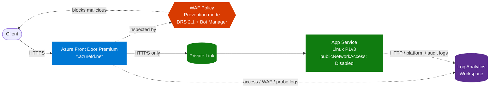

# Secure Azure Front Door with Bicep

Infrastructure-as-Code for a production-pattern Azure deployment: Azure Front Door Premium in front of an App Service origin, with a Web Application Firewall, Private Link origin lockdown, and full diagnostic logging to Log Analytics.

## Architecture



## What it deploys

| Resource | Purpose |
| --- | --- |
| Azure Front Door Premium | Global edge, TLS termination, HTTP→HTTPS redirect |
| WAF Policy (Prevention) | Microsoft Default Rule Set 2.1 + Bot Manager 1.1 |
| App Service Plan (Linux P1v3) | Hosts the origin web app |
| App Service (Web App) | The origin — reachable only via Private Link |
| Shared Private Link | Tunnel from Front Door to App Service |
| Log Analytics Workspace | Sink for all access, WAF, and platform logs |
| Diagnostic Settings | Wires Front Door + App Service logs into the workspace |

## Security properties

- **No public origin.** App Service has `publicNetworkAccess: Disabled`. The `*.azurewebsites.net` hostname is unreachable; all ingress must come through Front Door over Private Link.
- **WAF in Prevention.** Malicious requests are blocked at the edge, not just logged.
- **HTTPS end-to-end.** Edge-in: `httpsRedirect: Enabled`. Edge-to-origin: `forwardingProtocol: HttpsOnly` with certificate name validation.
- **Modern TLS only.** App Service enforces TLS 1.2 minimum, FTPS disabled.
- **Default-deny IP rules.** App Service access restrictions default to Deny.
- **Auditable.** WAF actions, access logs, health probes, and App Service platform logs all stream to Log Analytics.

## File layout

```
.
├── main.bicep                  # Entry point — wires the modules together
├── main.bicepparam             # Parameter values
├── deploy.ps1                  # Convenience wrapper (deploy + approve Private Link)
└── modules/
    ├── log-analytics.bicep     # Workspace
    ├── app-service.bicep       # Plan + Web App
    ├── waf-policy.bicep        # Front Door WAF policy
    ├── front-door.bicep        # Profile, endpoint, origin, route, security policy
    └── diagnostics.bicep       # Diagnostic settings wiring logs into the workspace
```

## Deploying

Requires an Azure subscription, Azure CLI, and PowerShell.

```powershell
# One-time setup
winget install Microsoft.AzureCLI
az login
az bicep install

# Validate
az bicep build --file main.bicep

# Preview
.\deploy.ps1 -WhatIf

# Deploy (10-15 minutes)
.\deploy.ps1
```

The deploy script also approves the pending Private Endpoint connection that Front Door creates against the App Service.

## Cost warning

This template is not free to run. Approximate monthly cost at idle:

| Resource | ~Monthly |
| --- | --- |
| Front Door Premium | $330 |
| App Service Plan P1v3 | $120 |
| Log Analytics | $0–5 |

Tear it down when you're done:

```powershell
az group delete -n rg-afdsec-eastus2 --yes --no-wait
```

## Testing

After deploying, the Front Door hostname is printed by `deploy.ps1`. Try:

```powershell
# 200 with x-azure-ref header
curl.exe -I "https://<frontdoor-hostname>/"

# 301 to https
curl.exe -I "http://<frontdoor-hostname>/"

# Connection refused — origin is locked down
curl.exe -I "https://<appservice-name>.azurewebsites.net/"

# WAF should block (403)
curl.exe -I "https://<frontdoor-hostname>/?id=1'%20OR%20'1'='1"
```

Then in the Log Analytics workspace:

```kusto
AzureDiagnostics
| where Category == "FrontDoorWebApplicationFirewallLog"
| where action_s == "Block"
| project TimeGenerated, action_s, ruleName_s, clientIP_s, requestUri_s
| take 20
```
